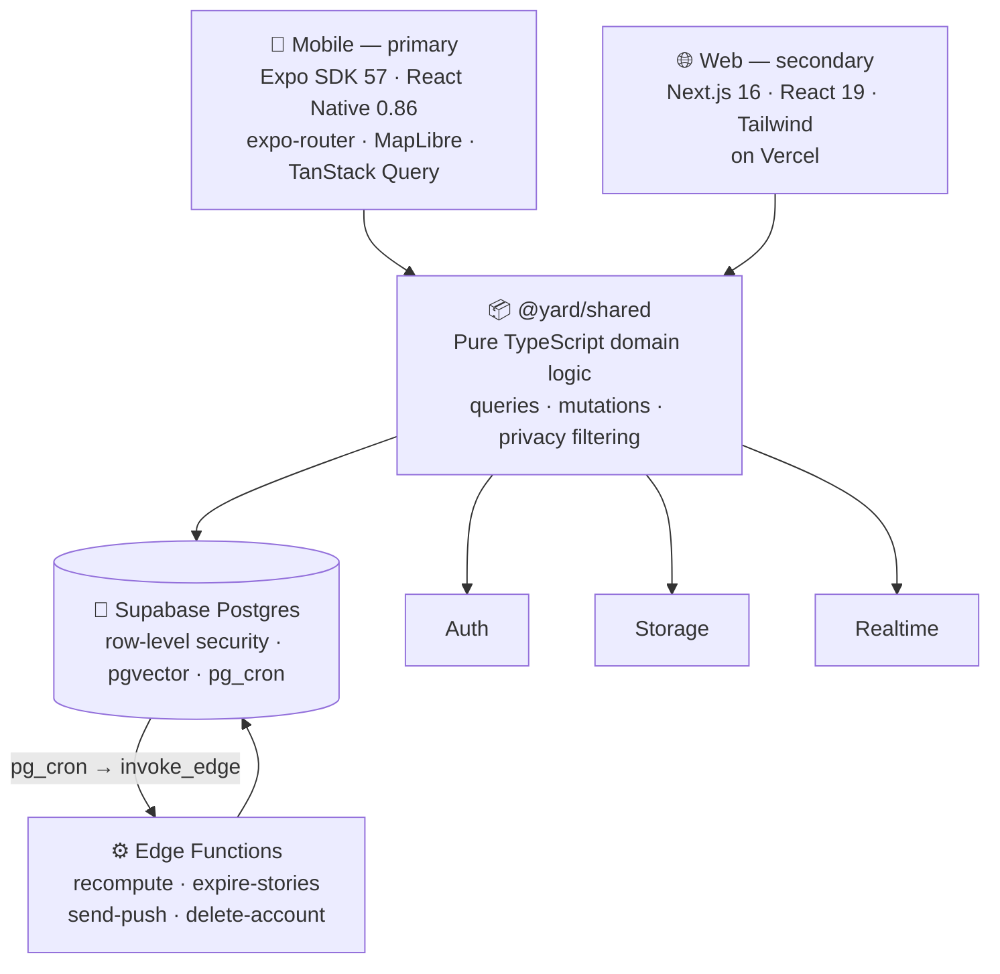

<h1 align="center">Yard</h1>

  A privacy-first neighbourhood social app where your posts grow into a garden on a map.

  
  
  

---

> **This is a case study, not the source.** Yard's application code is private while it is in
> review. What's here is the architecture, the data and privacy model, and the reasoning behind
> the decisions I'd want to be asked about. No application source, no SQL.

  

## What it is

Posts you choose to pin appear on a real map as **plants**, on ground **patches** you claim.
Plants grow through three stages. A nightly job cross-pollinates the gardens of people whose
posts keep landing in the same places at the same times, producing shared **hybrid blooms**.

Around that sit the things a social app needs to be usable at all — photo posts, 24-hour
stories, reels, direct messages, comments, follows, close friends, blocking, moderation,
push notifications.

The map is the part worth reading about. Everything below is about that.

## Screens

| | | |
| :--: | :--: | :--: |
|  |  |  |
| **Map garden** Pinned posts as plants on claimed ground | **Garden Wrapped** A season of your garden, built to be shared | **Hybrid bloom** Generated between two people who keep crossing paths |
|  |  |  |
| **Leave a drop** A note or time capsule, with an open date | **Plots** A patch a few people co-own, with its own chat | **Post composer** Capture, edit, choose an audience |

## Architecture

Two clients, one backend, and a shared domain package that both clients run.

**Every query and mutation lives in `@yard/shared` and takes a `SupabaseClient` as its first
argument.** A React Native screen and a Next.js route call the same function rather than
reimplementing it per platform. That is what makes the privacy model enforceable from one
place instead of two — which matters more than the code reuse does.

→ **[Full architecture notes](docs/architecture.md)**

## Three things worth reading

### [Authorisation lives in the database](docs/data-model.md)

An application-level permission check can be bypassed by a bug in any single route. Map
privacy is enforced in Postgres row-level security instead, and it is layered: a profile flag
gates a garden as a whole, a per-post setting gates each individual plant, and a stranger sees
a pin only when both allow it. Coordinates are filtered server-side — the client is never sent
a location it isn't entitled to.

### [Pollination, and tuning as a discipline](docs/pollination.md)

Two posts within 150 m and 72 hours count as a *crossing*. Crossings accumulate into a
weighted streak that decays by falling out of a 60-day window, with a per-place cap so a
shared commute can't manufacture a match. Every constant is documented with its reasoning,
including the one currently set to a test value — and the comment says so.

### [Invisible, not locked](docs/data-model.md#plots--invisible-not-locked)

A co-owned plot a stranger could see but not enter would advertise that a group of people
gather at a specific place. That's the one fact a private group most needs hidden. So plots
are members-only in both directions: a stranger doesn't see a locked plot, they see nothing.

## Stack

| | |
| :-- | :-- |
| **Mobile** | Expo SDK 57 · React Native 0.86 · React 19 · expo-router · TanStack Query · MapLibre RN v11 · expo-video · EAS + `expo-updates` OTA |
| **Web** | Next.js 16 (App Router) · React 19 · Tailwind · TypeScript · Vercel |
| **Shared** | Pure TypeScript, no framework dependency |
| **Backend** | Supabase — Postgres, Auth, Realtime, Storage, pgvector, pg_cron |
| **Embeddings** | OpenAI `text-embedding-3-small` @ 384d, with a deterministic hash fallback |

## Where it actually is

Honest version, because you can check:

- **TestFlight beta, submitted to App Store review.** Not publicly released. No user numbers.
- **The web client is behind mobile** on features, and is secondary by design.
- **Migrations are applied by hand**, in filename order. There's a schema audit script because
  missing ones were found the hard way, one runtime error at a time.
- **Tests are targeted, not broad** — the pollination maths, visibility rules and media
  handling, which are the places a silent error would be invisible.
- **The bloom threshold is at a test value**, lowered so the mechanic fires often enough to
  observe. It goes back before any real launch.
- **No CI.** Verification is a documented manual ritual: type-check all three packages, then a
  full native export and web build.

Solo build. 61 commits between May and September 2026, across roughly 37,000 lines: two client
apps, one shared package, 42 migrations and four scheduled functions.

---

  <a href="https://leohngdev.github.io">leohngdev.github.io</a> ·
  <a href="mailto:hnguyen.leo04@gmail.com">hnguyen.leo04@gmail.com</a>

