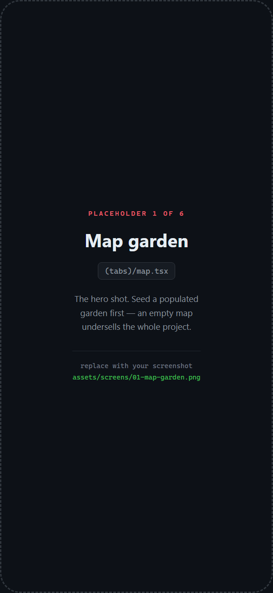
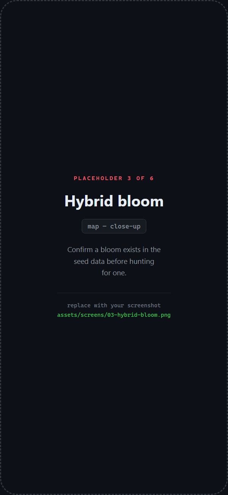
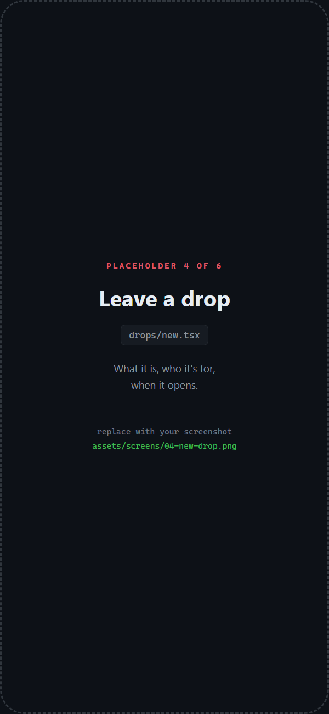
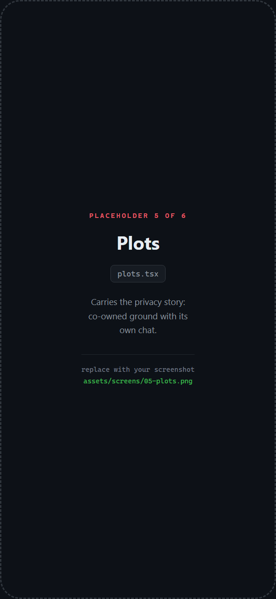
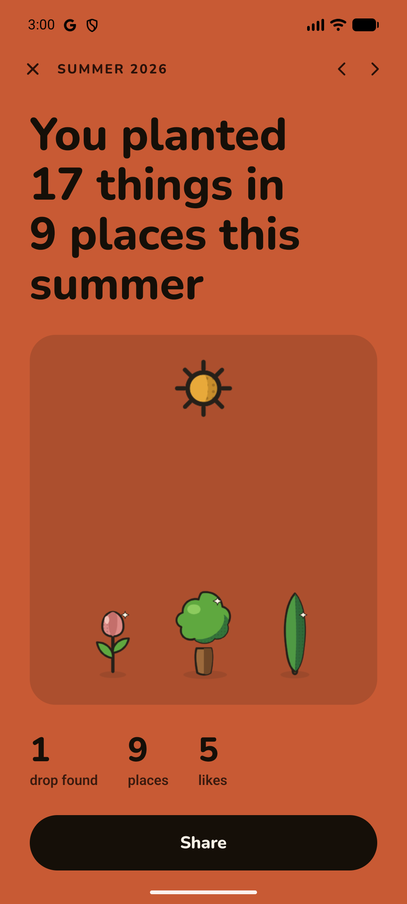
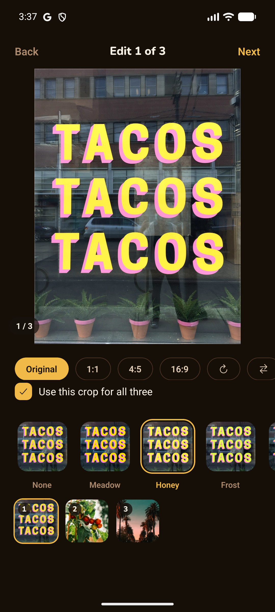
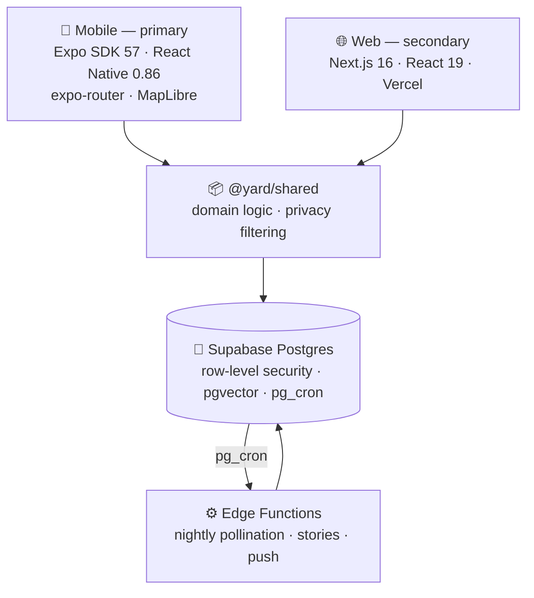

<h1 align="center">🌱 Yard</h1>

  <b>Post where you are. Watch it grow.</b>

  A privacy-first neighbourhood social app. Your posts don't scroll away 
  they take root on a map, and the neighbourhood grows around them.

  
  
  

  

---

## The idea

Every social app puts your life in a list that scrolls away. Yard puts it somewhere.

Pin a post and it becomes a **plant** on a real map, on ground you've **claimed**. It grows
through three stages as it ages. Over months your neighbourhood stops being a feed and starts
being a garden, yours, and everyone else's, overlapping.

Then the part that makes it a *social* map rather than a private diary: if you and someone
else keep posting from the same places at the same times, the app notices, and your gardens
**cross-pollinate** into a shared bloom neither of you planted.

You were both there. Now something grew there.

---

## What it does

<table>
<tr>
<td width="30%" align="center"></td>
<td valign="middle">

### 🗺️ A map that grows

Pinned posts appear as plants on claimed ground. Three growth stages, tied to age, and
**growth changes the drawing, never the size**, so a popular post never becomes a landmark
looming over the map it shares with everyone else.

</td>
</tr>
<tr>
<td valign="middle">

### 🌸 Blooms you didn't plant

Post from the same places, around the same times as someone else, and a **hybrid bloom**
appears between your gardens.

Not "you both like this café" - *you keep crossing paths*. The clock is what makes the
difference, and the bloom sits at a blurred centroid so it never gives away where either of
you actually was.

</td>
<td width="30%" align="center"></td>
</tr>
<tr>
<td width="30%" align="center"></td>
<td valign="middle">

### 🎁 Leave something behind

A note, an item, a time capsule — left at a place for someone to find. Pick what it is, who
it's for, and when it opens.

Then find out whether anyone found it. Without that half, it's throwing something into a well.

</td>
</tr>
<tr>
<td valign="middle">

### 🏡 Ground you share

A **plot** is a patch a few people co-own, with its own group chat.

A stranger doesn't see a locked plot, they see *nothing*. A visible-but-locked patch would
announce that a group gathers at a specific place, which is the one thing a private group most
needs hidden.

</td>
<td width="30%" align="center"></td>
</tr>
</table>

---

## Every season, wrapped

  
  &nbsp;&nbsp;&nbsp;
  

  <b>Garden Wrapped</b>: a season of your garden, built to be screenshotted. 
  <b>Composer</b>: capture, edit, and choose exactly who sees it.

Plus the things a social app needs to be usable at all: 24-hour stories, reels, direct messages
and group chats, comments, follows and follow requests, close friends, private profiles,
blocking, moderation, drafts, search and push notifications.

---

## Under the hood

Built solo. Two client apps, one shared domain package, and a Postgres backend that enforces
its own privacy rules.

Three things I'd want to be asked about:

| | |
| :-- | :-- |
| **[Authorisation lives in the database →](docs/data-model.md)** | A permission check in a route can be bypassed by a bug in that route. Map privacy is enforced in Postgres row-level security instead, layered so a garden-wide switch and a per-post setting must *both* allow a pin. Coordinates are filtered server-side, the client never receives a location it isn't entitled to. |
| **[Pollination, tuning as a discipline →](docs/pollination.md)** | 150 m and 72 hours make a crossing. Crossings decay out of a 60-day window, capped per place so a shared commute can't fake a match. Every constant is documented with its reasoning, including the one currently set to a test value, which says so in the code. |
| **[The architecture →](docs/architecture.md)** | Every query takes a `SupabaseClient` as its first argument and lives in one shared package, so both clients run identical logic. Privacy filtering *is* data logic, one implementation means one place to audit. |

**Stack:** Expo SDK 57 · React Native 0.86 · React 19 · expo-router · TanStack Query · MapLibre
· expo-video · EAS OTA · Next.js 16 · Tailwind · Supabase (Postgres, Auth, Realtime, Storage,
pgvector, pg_cron) · OpenAI embeddings with a deterministic fallback

---

## Where it actually is

**In TestFlight beta and submitted to App Store review, not publicly released.** No user
numbers to quote.

The source stays private while it's in review; this page is the tour. What's public here is
the architecture and the reasoning, which is the part worth reading anyway.

Solo build: 61 commits between May and September 2026, roughly 37,000 lines across two client
apps, one shared package, 42 migrations and four scheduled functions. The web client is
deliberately secondary and behind mobile on features.

Tests are targeted rather than broad: the pollination maths, the visibility rules, the media handling, which are the places a silent
error would be invisible.

---

  <b>Leo Nguyen</b> · Melbourne 
  <a href="https://leohngdev.github.io">leohngdev.github.io</a> ·
  <a href="mailto:hnguyen.leo04@gmail.com">hnguyen.leo04@gmail.com</a>

