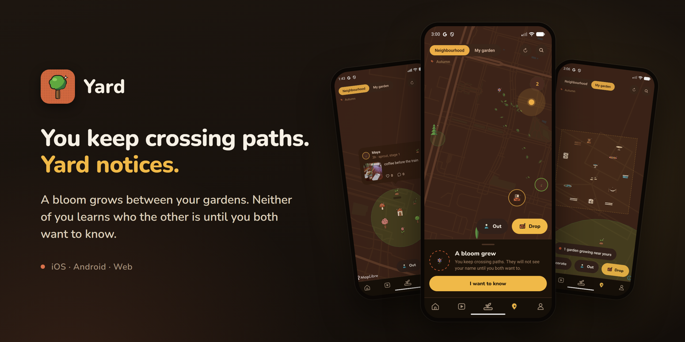
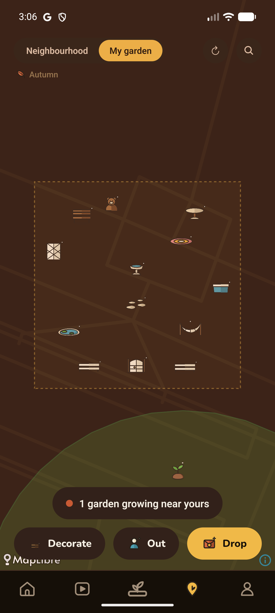
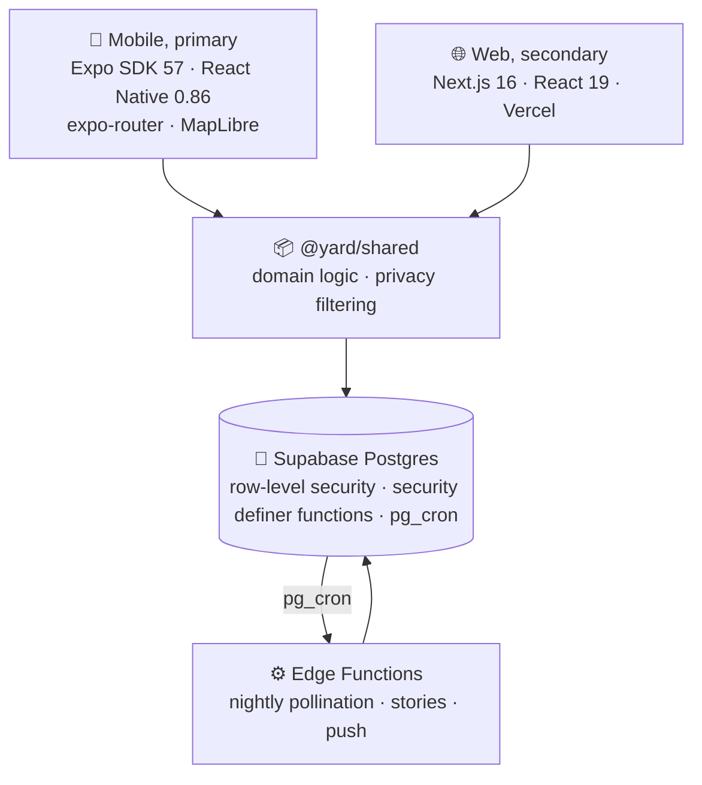

<h1 align="center">🌱 Yard</h1>

  <b>You keep crossing paths. Yard notices.</b>

  Your posts take root on a map as plants. When you and someone keep turning up in the same 
  places, a bloom grows between your gardens, and neither of you learns who the other is 
  until you both want to know.

  
  
  

  

---

## The idea

You keep crossing paths with someone. The same café, the same park, the same corner, week
after week, and neither of you knows it.

Yard notices. A **bloom** grows between your two gardens, on a map only the two of you can
see. It carries no name and no face. Each of you can tap **I want to know**, and neither of you
can see whether the other has. Once you both have, the names appear and you're in a
conversation. What happens after that is up to you.

The garden is how it notices. Pin a post and it becomes a **plant** on the map, where you
stood, on ground you've claimed. It grows through three stages as it ages. Every night Yard
compares where people's plants landed and when, and a bloom only grows between two people who
keep overlapping.

---

## How a bloom happens

1. **You opt in.** Crossing paths is off until you say yes. Yard asks once, during onboarding,
   and the switch lives in Settings after that.
2. **You plant.** Only posts you pin for others count. A private post never makes a crossing,
   and Yard never reads your live location to find one.
3. **Yard notices, slowly.** Once a night, two plants within 150 m and 72 hours of each other
   count as a crossing. A bloom takes repeated crossings inside 60 days, and one place can
   only count for so much, so a shared commute can't fake one.
4. **A bloom grows.** It sits at a blurred centroid of where you crossed, never at either
   person's spot. A trail of leaves points toward the other garden and stops at a fixed
   distance, so it gives a direction, not an address.
5. **The door.** No name, no face, no profile until you both tap. Then you're in a DM.

Nobody gets more than three new blooms a week. There's no list of people near you, and
strangers only ever appear on your map as plants.

---

## What it does

<table>
<tr>
<td width="30%" align="center"></td>
<td valign="middle">

### 🌸 A bloom is a door

Keep crossing paths with someone and a **hybrid bloom** grows between your gardens, visible to
the two of you alone.

The clock is what makes it mean something. Two people posting from one café a month apart
share a taste. Two people posting from it within three days, again and again, keep crossing
paths. Only the second grows a bloom.

</td>
</tr>
<tr>
<td valign="middle">

### 🗺️ A map that grows

Pinned posts appear as plants where you stood, on claimed ground. Three growth stages, tied to
age, and **growth changes the drawing, never the size**, so a popular post never becomes a
landmark looming over everyone else's.

Strangers' plants show within 2 km of you and no further.

</td>
<td width="30%" align="center"></td>
</tr>
<tr>
<td width="30%" align="center"></td>
<td valign="middle">

### 🎁 Leave something behind

A note, an item, a time capsule, left at a place for someone to find. Pick what it is, who
it's for, and when it opens. It only opens for whoever walks there.

Then find out whether anyone found it. Without that half, it's throwing something into a well.

</td>
</tr>
<tr>
<td valign="middle">

### 🏡 Ground you share

A **plot** is a patch a few people co-own, with its own group chat.

A stranger doesn't see a locked plot, they see *nothing*. A visible-but-locked patch would
announce that a group gathers at a specific place, which is the one thing a private group most
needs hidden.

</td>
<td width="30%" align="center"></td>
</tr>
<tr>
<td width="30%" align="center"></td>
<td valign="middle">

### 🪑 A patch of your own

Put down a patch and "My garden" zooms right into it. Two tabs of things to place, Yard and
Garden: a bench, a pond, a hammock, a gate. Only people you've accepted as followers can see it.

</td>
</tr>
</table>

---

## Every season, wrapped

  
  &nbsp;&nbsp;&nbsp;
  

  <b>Garden Wrapped</b>: a season of your garden, built to be screenshotted. 
  <b>Composer</b>: capture, edit, and choose exactly who sees it.

Around the garden sit the things a social app needs to be usable at all: posts of up to 22
photos and clips, a live camera, 24-hour stories, reels, direct messages and group chats,
comments, follows and follow requests, close friends, private profiles, blocking, moderation,
drafts, search, push notifications, and a patch of your own to decorate.

---

## Under the hood

Built solo. Two client apps, one shared domain package, and a Postgres backend that enforces
its own privacy rules.

Three things I'd want to be asked about:

| | |
| :-- | :-- |
| **[Authorisation lives in the database →](docs/data-model.md)** | A permission check in a route can be bypassed by a bug in that route, so Yard's privacy rules live in Postgres. A post's audience, and the rule that strangers only see plants within 2 km, are applied inside a `SECURITY DEFINER` function, so a client never receives a coordinate it isn't entitled to. The bloom door works the same way. Clients can't read the bloom table at all, because a row names both people, and a function hands back the other person only once both have said yes. |
| **[Pollination, tuning as a discipline →](docs/pollination.md)** | 150 m and 72 hours make a crossing. Crossings fall out of a 60-day window and are capped per place, so a shared commute can't fake a streak on its own, and nobody gets more than three new blooms a week. Every constant is documented with its reasoning, including the one currently set to a test value, which says so in the code. |
| **[The architecture →](docs/architecture.md)** | Every query takes a `SupabaseClient` as its first argument and lives in one shared package, so both clients run identical logic. Privacy filtering *is* data logic, and one implementation means one place to audit. |

**Stack:** Expo SDK 57 · React Native 0.86 · React 19 · expo-router · TanStack Query · MapLibre
· expo-camera · expo-video · EAS OTA · Next.js 16 · Tailwind · Supabase (Postgres, Auth,
Realtime, Storage, Edge Functions, pg_cron)

---

## Where it actually is

**In TestFlight beta and submitted to App Store review, not publicly released.** No user
numbers to quote.

It launches in my own neighbourhood first. A bloom needs two people crossing paths, and that
takes enough people in one place, so the first launch is one place.

The source stays private while it's in review; this page is the tour. What's public here is
the architecture and the reasoning, which is the part worth reading anyway.

Solo build: 72 commits between May and September 2026, roughly 46,000 lines across two client
apps, one shared package, 50 migrations and four edge functions. The web client is deliberately
secondary and behind mobile on features.

Tests are targeted rather than broad: 110 of them, on the places a silent error would be
invisible. The pollination maths, the visibility rules, the media handling, the table grants,
and the SQL behind the bloom door, which a test reads to make sure the other person stays
hidden until both say yes.

---

  <b>Leo Nguyen</b> · Melbourne 
  <a href="https://leohngdev.github.io">leohngdev.github.io</a> ·
  <a href="mailto:hnguyen.leo04@gmail.com">hnguyen.leo04@gmail.com</a>

