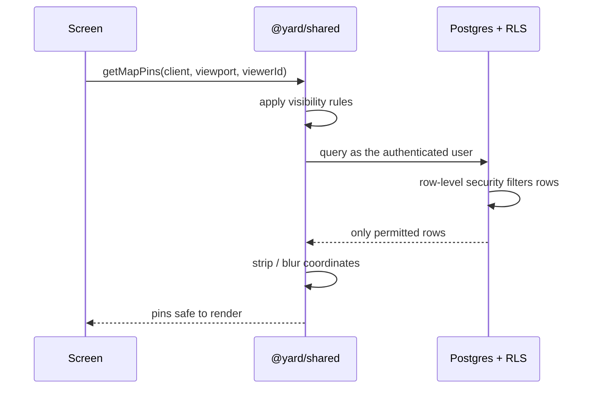

# Architecture

[← back to the case study](../README.md)

Yard is a monorepo with two clients and one backend. The clients are not peers: **mobile is
the primary surface** and gets features first; web is a secondary, feed-style client that is
deliberately behind.

```
apps/mobile/       Expo SDK 57 (expo-router) — iOS + Android. Most work happens here.
apps/web/          Next.js 16 (App Router) on Vercel — secondary client.
packages/shared/   @yard/shared — pure-TypeScript domain logic used by BOTH clients.
supabase/
  migrations/      42 SQL migrations, applied in filename order.
  functions/       Edge Functions — scheduled jobs and push fan-out.
```

## The shared package is the load-bearing decision

Every query and mutation lives in `@yard/shared`, and each one takes a `SupabaseClient` as its
first argument:

```
getMapPins(client, viewport, viewerId)
```

Both clients pass their own configured client and get identical behaviour. A React Native
screen and a Next.js route handler call the same function.

The obvious benefit is not duplicating data logic across two platforms. The benefit that
actually justifies the structure is different: **privacy filtering is data logic.** If the
rule "a viewer may only see coordinates they are entitled to" is implemented per client, it
will eventually be implemented differently per client, and one of the two will be wrong. With
one implementation there is one place to audit and one place to fix.

The rule that follows: when adding a feature, the data logic goes in `packages/shared`, not in
a screen.

## Request path



Two independent filters sit between a row and a screen: RLS in the database, and visibility
logic in shared. Neither is trusted alone. The client receives data already safe to render —
there is no "hide it in the UI" step, because a coordinate that reached the client has already
leaked.

## Scheduled work

Crons run through `pg_cron`, which calls `private.invoke_edge` to reach an Edge Function.
Functions are deployed with JWT verification off and authenticate on a `CRON_SECRET` bearer
check instead, because the caller is the database rather than a user.

| Function | Trigger | Job |
| :-- | :-- | :-- |
| `recompute` | Nightly | Recompute pollination blooms |
| `expire-stories` | Hourly | Delete expired stories and their storage files |
| `send-push` | Trigger on new notification rows | Resolve Expo push tokens, fan out |
| `delete-account` | On demand | Best-effort media cleanup, then cascading auth deletion |

`delete-account` exists as a function because the Expo client cannot run Next.js server
actions — the web app had this as a server action first, and the mobile client needed the same
capability without the same runtime.

## A constraint that shaped the code

Edge Functions run on Deno and **cannot import the workspace**, so the `recompute` function
keeps its own copy of the pollination tuning constants. Two copies of the same numbers is a
drift bug waiting to happen, so a check script fails the build if they diverge.

This is the kind of thing worth writing down: the duplication is deliberate, the risk it
creates is known, and the guard against it is automated rather than remembered.

## Delivery

Mobile ships through EAS. The distinction that governs day-to-day work:

- **Native change** (a new native module, a config plugin) → a new cloud build.
- **JS or asset change** → `eas update`, an over-the-air push to a channel.

Channels are `development`, `preview` and `production`, and an update's branch must match the
installed build's channel. An OTA update takes two cold starts to appear: the first downloads
it, the second applies it.

Web deploys from the same monorepo on Vercel, with the project root set to `apps/web` and
"include source files outside the root directory" enabled so `packages/shared` resolves.

## Theming

One source. `packages/shared/src/theme.ts` feeds mobile directly, and web mirrors it into
`globals.css` and `tailwind.config.ts`. All three change in one commit — a theme that drifts
between clients is a theme that no longer exists.

## What I would change

- **Migrations are applied by hand** in the SQL editor rather than through a migration tool in
  CI. That worked at one developer and would not survive a second. The schema audit script
  exists precisely because this approach loses migrations.
- **No CI.** The verification steps are written down and followed, but written down is not the
  same as enforced.
- **The web client's drift is now a cost.** Keeping a secondary client roughly in step takes
  real effort, and the honest answer is that it hasn't been worth it recently.
