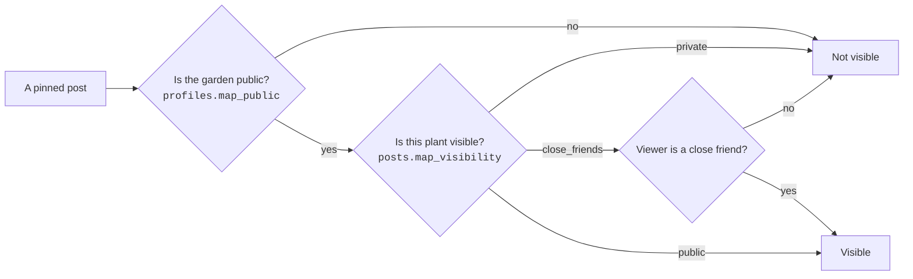

# Data model and privacy

[← back to the case study](../README.md)

A social app's privacy model is its data model. This page is about where the rules live and
why they live there rather than what the columns are called.

## The principle

**An application-level permission check can be bypassed by a bug in any single route.** One
forgotten `where` clause in one handler and the rule is gone, silently, with no error and
nothing in the logs.

So the rules live in Postgres row-level security, which every query passes through regardless
of which client wrote it or which route it came from. Above that sits visibility logic in
`@yard/shared`. Neither is trusted alone.

## Map privacy is layered

Two independent gates control whether a stranger sees a plant on the map:

A garden-wide switch alone is too coarse — it forces a choice between publishing everything
and publishing nothing. A per-post setting alone is too easy to get wrong once, permanently.
Requiring both means the blunt control is available for the common case, and the fine control
never silently overrides it.

**Coordinates are filtered server-side in `packages/shared`, never merely hidden in the UI.**
This is the part that matters. A pin the viewer isn't entitled to is not sent dimmed, or sent
and hidden behind a conditional render — it is not sent. Anything that reaches the client has
already leaked, whatever the interface does with it afterwards.

## Plots — invisible, not locked

A **plot** is a patch of map a few people co-own, with its own group chat.

The obvious design is a locked area: everyone sees it, members can enter. That design leaks
the single most sensitive fact in the feature. A visible-but-locked patch tells any stranger
that *a group of people gather at this specific place* — which is precisely what a private
group needs hidden, and knowing the members' names adds very little on top of it.

So membership gates visibility in **both** directions. A stranger doesn't see a locked plot;
they see nothing at all. Enforced in RLS, not by filtering the list client-side.

This threat exists only at the product level. No test suite would have surfaced it, because
the locked version works exactly as specified.

## The same reasoning, applied elsewhere

| Feature | Rule | Enforced by |
| :-- | :-- | :-- |
| **Drafts** | Visible only to their author | RLS on post status, not a client filter |
| **Blocking** | Enforced on read, both directions | RLS |
| **Close friends** | Restricts the post itself, and the audience is told | RLS + an indicator in the UI |
| **Private profiles** | Follow requests gate the content | RLS |
| **Media** | Storage access follows post visibility | Storage policies |

The close-friends row is worth a note. An earlier version restricted who *saw* a post but gave
the audience no indication it was restricted — so people didn't know how visible they were
being. Enforcement and legibility are different problems and both are required; telling
someone their post is limited is part of the privacy feature, not decoration.

## Growth and decay, without a cron

Two mechanics age, and neither runs a scheduled job to do it.

- **Plant stages** derive from the post's age at read time.
- **Emblem stage** derives from account age plus recent activity, and decays if you go quiet.
- **Pollination streaks** decay by crossings falling out of a 60-day window.

Computing from a timestamp at read time rather than writing state on a schedule means there is
no drift, no backfill, and no job to fail quietly overnight. The trade is a little work per
read, which is cheap, against a whole class of "the cron didn't run" bugs, which is not.

## Two rules about growth

**The species is chosen, the stage is earned.** An emblem's species is picked by the user; its
stage comes from account age and recent activity. Identity is yours to choose, standing is
not.

**Growth changes the sprite, never the size.** A plant at stage three is a different drawing,
not a larger one. "The same picture but bigger" isn't growth, and a popular post shouldn't
become a landmark that dominates a map it shares with other people.

## Pinning is not placing

`posts.pinned_at` pins a post to the top of your **profile**. Putting a post on the **map** is
a separate choice with its own visibility setting.

Collapsing the two would be simpler to build and wrong: "this represents me" and "this happened
here, and strangers may see where" are unrelated decisions, and one of them has a privacy
consequence.
