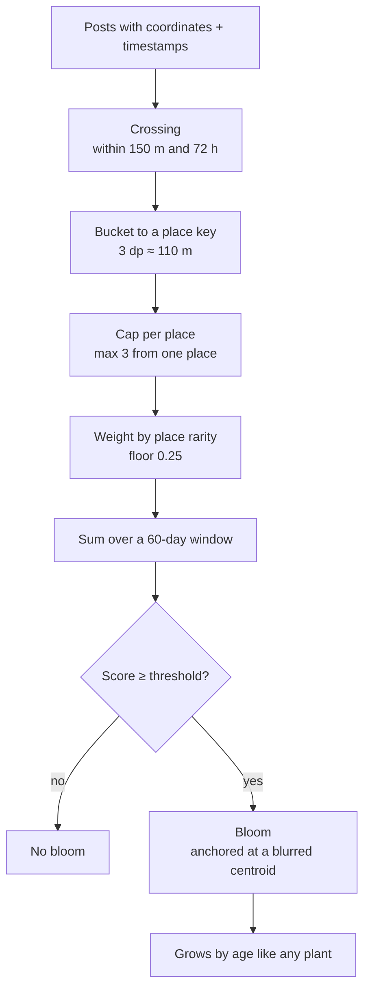

# Pollination

[← back to the case study](../README.md)

Pollination generates a shared **hybrid bloom** between two people whose posts keep landing in
the same places at similar times. It is the most distinctive thing in Yard and the part I'd
most want to be asked about.

## The idea

Most recommendation features answer *"who is like you?"* from interests or behaviour.
Pollination answers something narrower and, I think, more meaningful in a neighbourhood app:
**"who keeps being where you are, when you're there?"**

The clock is what makes the difference. Two people posting from the same café a month apart
share a taste. Two people posting from the same café within three days, repeatedly, keep
crossing paths. Only the second is worth surfacing.

## How it works

Recomputed nightly by an Edge Function, triggered from `pg_cron`.

## Every constant, and why

These live together in one object in shared code, not in the schema — because retuning the
mechanic must never require a migration. It will be retuned repeatedly, and migrations here
are applied by hand.

| Constant | Value | Reasoning |
| :-- | --: | :-- |
| `crossingRadiusM` | 150 m | Two posts this close count as the same place |
| `crossingWindowH` | 72 h | …and this close in time count as **one** crossing. The clock is what makes this *"we were both here"* rather than *"we both like this café"* |
| `streakWindowDays` | 60 | Older crossings fall out of the streak. This **is** the decay model — no cron, no drift |
| `placeCap` | 3 | The most one place may contribute to one pair, so a shared commute can't manufacture a streak on its own |
| `bloomThreshold` | 2 | Weighted score at which a bloom exists. **Design value is 5** — see below |
| `rarityFloor` | 0.25 | Busy places still count for something |
| place key precision | 3 dp ≈ 110 m | *"That corner"*, not *"that bench"*. Deliberately coarser than the ~11 m patch grid |

### The threshold is currently wrong, on purpose

`bloomThreshold` is 2. The design value is 5.

At launch scale nobody would ever reach 5. The mechanic would ship, do nothing, and teach me
nothing about whether the design is right. At 2 it fires often enough to watch end to end
during testing.

It goes back to 5 before any real launch. Past that point a bloom stops meaning *"we keep
crossing paths"* and starts meaning *"we were both once near the same corner"* — which is a
different, worse product.

I'm documenting it here for the same reason it's documented in the code: a magic number that
disagrees with its own design intent is a bug the moment everyone forgets why.

## Three decisions inside the mechanic

### Rarity weighting, and a floor under it

A crossing at a train station says much less than a crossing at a quiet corner, so places are
weighted by how common they are. But a floor of 0.25 stops busy places counting for nothing —
people really do meet at stations, and a weighting scheme that rounds that to zero is as wrong
as one that ignores rarity.

### The anchor is a blurred centroid

A bloom sits at a blurred centroid of the pair's crossing places — **not** at the midpoint of
two specific posts.

A midpoint is reversible. Given a bloom's location and your own post, you could work out
roughly where the other person was. A privacy leak inside a discovery feature would be a bad
trade for a slightly more precise pin.

### The embedding layer degrades to something deterministic

Post similarity uses OpenAI `text-embedding-3-small` at 384 dimensions when an API key is
configured, and a **deterministic hash embedding** when one isn't.

The fallback is not a good embedding. It's a consistent one — the same input always produces
the same vector — which means the pipeline runs unattended, in local development and in CI,
without a key and without special-casing. A nightly job that only works when an external
service is reachable is a nightly job that will fail on a night nobody is watching.

## What went wrong first

The first version ranked confidently on sparse data. With few posts and few crossings, it
produced pairings that were technically the top of the list and meaningless in practice —
which is worse than showing nothing, because a blank space is honest and a confident wrong
answer teaches people not to trust the feature.

The fixes were distance thresholds and the deterministic fallback, which together mean the
pipeline either produces a bloom that clears a real bar, or produces nothing. **Failing
visibly beats failing plausibly.**

## Testing

The pollination maths carries the largest unit test file in the project. The mechanic is
exactly the kind of code where an error is invisible — nothing crashes, nothing logs, you just
get subtly wrong pairings — and that is the case for testing it rather than the parts that
announce their own failures.

Because Edge Functions run on Deno and can't import the workspace, the function keeps its own
copy of the tuning constants, and a check script fails the build if the two copies drift.
